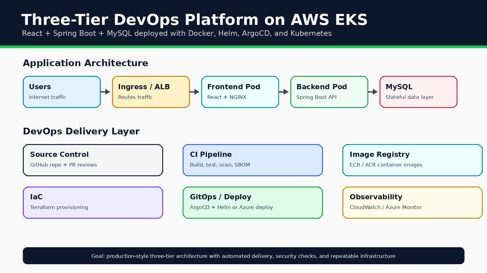
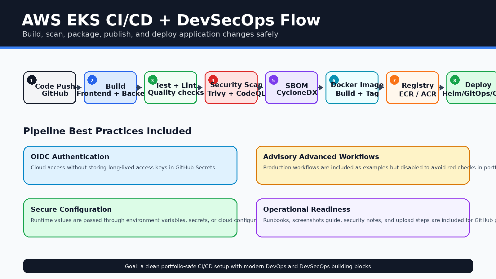
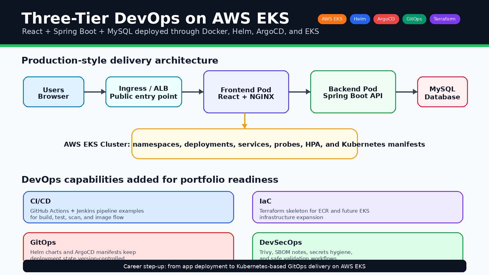
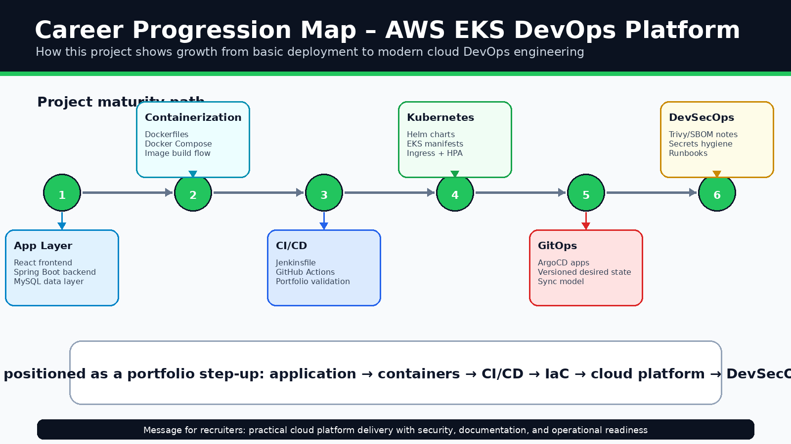

# Three-Tier DevOps Platfor m on AWS EKS

A production-style DevOps project for deploying a **React frontend**, **Spring Boot backend**, and **MySQL database** using **Docker**, **Helm**, **ArgoCD GitOps**, and **AWS EKS**.

This project keeps the original three-tier application recipe, then adds modern DevOps practices around containerization, Kubernetes deployment, GitOps, CI/CD validation, security scanning, SBOM notes, and operational documentation.

## Architecture

Generated project visual assets and any existing snapshots are included below to make the repository clear and professional for GitHub visitors.



## CI/CD and GitOps Flow




## Portfolio visuals and career progression

These visuals were added so the project looks complete even when live cloud screenshots are not available. They explain the architecture, DevOps workflow, and how this project represents a step forward in cloud/platform engineering.





## What this project demonstrates

- Three-tier application architecture
- React frontend containerization
- Spring Boot backend containerization
- MySQL database support for local development
- Docker Compose for local testing
- Helm charts for Kubernetes deployments
- ArgoCD manifests for GitOps delivery
- AWS EKS-ready deployment structure
- ECR repository Terraform skeleton
- Jenkins pipeline example
- GitHub Actions portfolio validation
- Optional Trivy, CodeQL, and SBOM workflow design
- AI-ready release summary script

## Project structure

```text
.
├── src/                    # React, Spring Boot, and local Docker Compose files
├── charts/                 # Helm charts for frontend/backend/umbrella app
├── argocd/                 # ArgoCD project and application manifests
├── infra/                  # Terraform skeleton for AWS/ECR expansion
├── .github/                # Safe portfolio validation workflow
├── docs/                   # Architecture, runbook, workflow, GenAI, screenshot notes
├── scripts/                # AI-ready release summary helper
├── Jenkinsfile             # Jenkins CI/CD pipeline example
└── README.md
```

## Local development

```bash
cd src
docker compose up --build
```

Frontend: `http://localhost:4200`

## Kubernetes deployment flow

1. Build frontend and backend images.
2. Push images to Amazon ECR.
3. Update Helm chart image tags.
4. ArgoCD syncs the desired state to EKS.
5. Ingress routes traffic to frontend/backend services.

## Jenkins pipeline

A Jenkinsfile is included to show a real CI/CD flow:

```text
Checkout → Frontend Build → Backend Build → Docker Build → Trivy Scan → Push Image → Helm Validate
```

The push/deploy stages are intentionally documented but not fully auto-enabled so the repo stays safe until AWS credentials and ECR registry names are configured.

## GitHub Actions note

Only a safe **Portfolio Validation** workflow runs automatically. Advanced production-style workflows are kept in `.github/workflows-disabled/` and can be enabled later after configuring OIDC, AWS roles, registry names, and environment variables.

## Security practices

- No `.env`, `.pem`, Terraform state, or cloud secrets committed
- Runtime values use environment variables or Kubernetes secrets
- ECR image scanning enabled in Terraform skeleton
- Trivy/SBOM workflow design documented
- ArgoCD/Helm deployment model keeps Kubernetes config version-controlled

## Future improvements

- Add full VPC + EKS Terraform module
- Enable GitHub Actions OIDC deployment
- Add Prometheus and Grafana monitoring
- Add external-secrets integration
- Add canary or blue/green release strategy

## Known issues

See [KNOWN_ISSUES.md](KNOWN_ISSUES.md).


---

<p align="center">
  
</p>

<h2 align="center">🤝 Connect With Me</h2>

<p align="center">
  <em>
    Thanks for visiting this project! I’m continuously building hands-on DevOps, Cloud, Automation, and AI-enabled engineering projects to improve real-world deployment, monitoring, and infrastructure skills.
  </em>
</p>

<p align="center">
  
</p>

<p align="center">
  <a href="https://github.com/yugandhar99" target="_blank" rel="noopener noreferrer">
    
  </a>
  <a href="https://www.linkedin.com/in/yugandhar-devops" target="_blank" rel="noopener noreferrer">
    
  </a>
  <a href="https://yugandhar-portfolio-psi.vercel.app/" target="_blank" rel="noopener noreferrer">
    
  </a>
  <a href="mailto:yugandharethamukkala1999@gmail.com">
    
  </a>
</p>

<p align="center">
  
  
  
  
</p>

---

<p align="center">
  ⭐ If this project added value, feel free to star the repository and connect with me!
</p>

<p align="center">
  <strong>Built with ❤️ using modern DevOps practices</strong>
</p>

